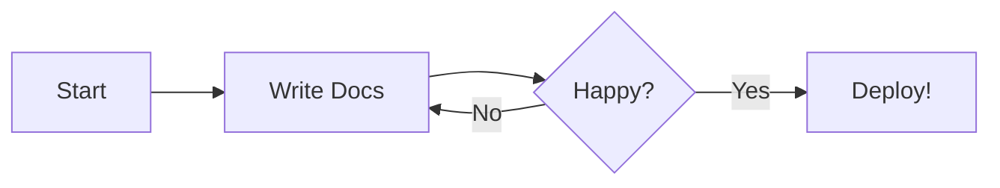

# 🚀 Getting Started Guide

This page demonstrates all the **Markdown features** available in this template.
Use it as a reference when writing your own documentation!

---

## 📝 Text Formatting

You can use **bold**, _italic_, ~~strikethrough~~, ==highlighted==, and `inline code`.

You can also write ^^underlined^^ text and use footnotes[^1].

[^1]: This is a footnote — useful for references and citations!

---

## 📋 Lists

### Unordered List

- Item one
- Item two
    - Nested item A
    - Nested item B
- Item three

### Ordered List

1. First step
2. Second step
3. Third step

### Task List

- [x] Set up MkDocs
- [x] Customize theme
- [ ] Write documentation
- [ ] Deploy to GitHub Pages

---

## 💡 Admonitions (Callout Boxes)

!!! note "This is a Note"

    Use notes to provide additional context or background information.

!!! tip "Helpful Tip"

    Use tips to share useful advice, shortcuts, or best practices.

!!! warning "Watch Out"

    Use warnings to highlight potential issues or pitfalls.

!!! danger "Critical Warning"

    Use danger boxes for critical information that could cause data loss or errors.

!!! example "Example"

    Use example boxes to show worked examples or demonstrations.

??? info "Collapsible Section (click to expand)"

    This content is hidden by default. Use `???` instead of `!!!` to make
    any admonition collapsible — great for long details that not everyone needs.

---

## 💻 Code Blocks

### Python

```python
def greet(name: str) -> str:
    """Return a greeting message."""
    return f"Hello, {name}! Welcome to MkDocs."

print(greet("Student"))
```

### JavaScript

```javascript
function fibonacci(n) {
  if (n <= 1) return n;
  return fibonacci(n - 1) + fibonacci(n - 2);
}

console.log(fibonacci(10)); // 55
```

### Arduino / C++

```cpp
void setup() {
  Serial.begin(9600);
  pinMode(LED_BUILTIN, OUTPUT);
}

void loop() {
  digitalWrite(LED_BUILTIN, HIGH);
  delay(1000);
  digitalWrite(LED_BUILTIN, LOW);
  delay(1000);
}
```

---

## 📊 Tables

| Feature         | Status      | Notes                     |
|:---------------|:-----------:|:--------------------------|
| Navigation Tabs | ✅ Done     | Four tabs configured       |
| Dark Mode       | ✅ Done     | Toggle in header           |
| Search          | ✅ Done     | Built-in search plugin     |
| Code Highlight  | ✅ Done     | Multiple languages         |
| Deployment      | ⏳ Pending  | GitHub Pages ready         |

---

## 🔀 Tabbed Content

Use tabs to organize alternative content — great for showing code in different
languages or steps for different operating systems.

=== "Windows"

    ```bash
    pip install mkdocs-material
    mkdocs serve
    ```

=== "macOS / Linux"

    ```bash
    pip3 install mkdocs-material
    mkdocs serve
    ```

=== "Docker"

    ```bash
    docker pull squidfunk/mkdocs-material
    docker run --rm -it -p 8000:8000 -v ${PWD}:/docs squidfunk/mkdocs-material
    ```

---

## 🖼️ Embedding Images from Google Drive

To embed an image stored in Google Drive:

1. **Upload** your image to Google Drive
2. **Share** it: Right-click → Share → Change to **"Anyone with the link"**
3. **Copy the link** — it will look like:
   ```
   https://drive.google.com/file/d/YOUR_FILE_ID/view?usp=sharing
   ```
4. **Extract the FILE_ID** (the long string after `/d/`)
5. **Use this Markdown** in your `.md` file:

```markdown

```

!!! tip "Image Size Control"

    Change `sz=w800` to adjust width:  
    - `sz=w400` — small  
    - `sz=w800` — medium  
    - `sz=w1200` — large  

### Example (replace with your image)

<!-- Uncomment and replace YOUR_FILE_ID with a real Google Drive file ID:

<p class="drive-image-caption">Caption: Describe your image here</p>
-->

_⬆️ Uncomment the block above and replace `YOUR_FILE_ID` to see your image!_

---

## 🔗 Useful Links

- [MkDocs Documentation](https://www.mkdocs.org/)
- [Material for MkDocs](https://squidfunk.github.io/mkdocs-material/)
- [Markdown Cheat Sheet](https://www.markdownguide.org/cheat-sheet/)
- [PyMdown Extensions](https://facelessuser.github.io/pymdown-extensions/)

---

## 📐 Diagrams with Mermaid



---

_That's it! Copy any of these elements into your own pages. Happy documenting!_ 🎉
